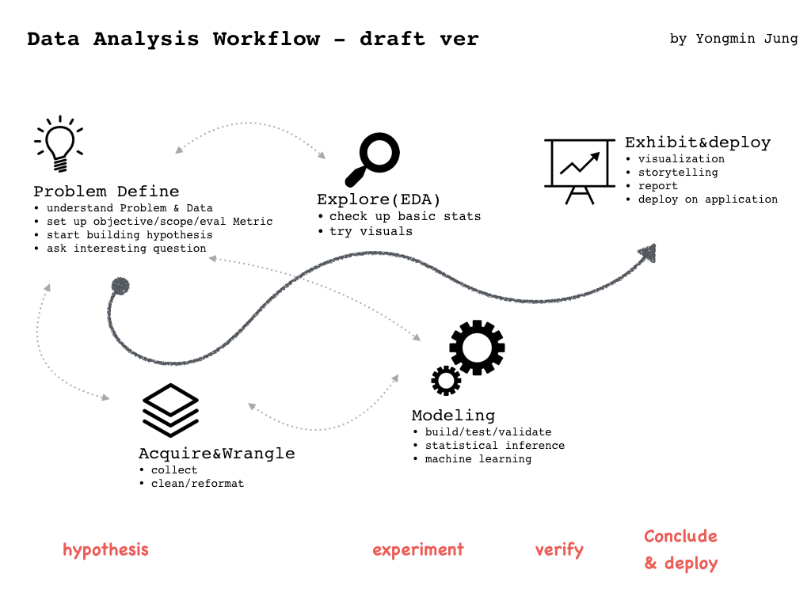

#Today I learned (TIL) on DataScience 

## I. Objectives
- 셀프스터디 자료 정리 및 재참조
- 셀프스터디 히스토리 기록

## II. Contents

### Books- ipynb 정리(by myself): 
- [Basic Statistics ](http://nbviewer.jupyter.org/github/h3imdallr/TIL-datascience/blob/master/ipynb_gitHub/Basic%20Statistics.ipynb ): Central Tendencies, Dispersion, Correlation, Simpsons' Paradox, Causation
- [Data Preparation ](http://nbviewer.jupyter.org/github/h3imdallr/TIL-datascience/blob/master/ipynb_gitHub/DataPreparation.ipynb): Loading, Cleaning, Transforming and Rearranging 
- [GroupOperation](http://nbviewer.jupyter.org/github/h3imdallr/TIL-datascience/blob/master/ipynb_gitHub/GroupOperation.ipynb) (On Progress):

### MOOCs- ipynb 정리(by myself):
- **Machine Learning, AndrewNg**  [(Course notes)](http://www.holehouse.org/mlclass/)
- **elice.io/KAIST MachineLearning Online Course(interactive coding)**
- **Intro to DataAnalysis/Udacity**  
    1. [Lecture1: getting started](http://nbviewer.jupyter.org/github/h3imdallr/TIL-datascience/blob/master/ipynb_gitHub/L1_Starter_Code_ymjung.ipynb)  
    2. [Lecture2: Numpy Pandas 1D](http://nbviewer.jupyter.org/github/h3imdallr/TIL-datascience/blob/master/ipynb_gitHub/L2_NumpynPandas_for_1D.ipynb)
    3. [Lecture3: Numpy Pandas 2D](http://nbviewer.jupyter.org/github/h3imdallr/TIL-datascience/blob/master/ipynb_gitHub/L3_NumpynPandas_for_2D.ipynb)

- **Machine Learing, Michael Littman**
- **Deep Learning, google**
    1. [Deep Neural Network(1/2)](http://nbviewer.jupyter.org/github/h3imdallr/TIL-datascience/blob/master/ipynb_gitHub/DeepGG-L2-DeepNeuralNetwork.ipynb)
    2. [Deep Neural Network (2/2)](http://nbviewer.jupyter.org/github/h3imdallr/TIL-datascience/blob/master/ipynb_gitHub/DeepGG-L3-Regularizatoin.ipynb)
    2. [Convolutional Neural Networks](http://nbviewer.jupyter.org/github/h3imdallr/TIL-datascience/blob/master/ipynb_gitHub/DeepGG-L4-convolutionNets.ipynb)
    3. Deep Models for text and Sequences

### CheatSheets: [Link](https://github.com/h3imdallr/TIL-datascience/tree/master/CheatSheet)

=====
=====

### StudySource: 
Note: Good References for ML/DeepL Study  
나같은 Noob에게 좋은 양질의 소스들.

#### :::CS for DataScience: Python,Scala,Spark,Hadoop
(General)
- (Python/MOOC)Intro to DataAnalysis, Udacity
- (Python/Book)Effective Python, 파이썬 코딩의 기술
- (Python/Book)The Hacker's Guide to Python, 실전 파이썬 프로그래밍 
- (Scala/Book)Functional Programming in Scala
- (Scala/Tut)ScalaSchool by Twitter

(Web)
- [Full Stack Python](https://www.fullstackpython.com)
- [Flask Tutorial-ko](http://flask-docs-kr.readthedocs.io/ko/latest/index.html)
- [(MOOC)Practical Flask Web Development Tutorials](https://www.youtube.com/playlist?list=PLQVvvaa0QuDc_owjTbIY4rbgXOFkUYOUB)
- [(MOOC)Flask Tutorial](https://www.youtube.com/playlist?list=PLei96ZX_m9sWQco3fwtSMqyGL-JDQo28l)
- [(Tut)The Flask Mega Tutorial](http://blog.miguelgrinberg.com/post/the-flask-mega-tutorial-part-i-hello-world)

#### :::ML General 
- (MOOC)MachineLearning, AndreNg, Coursera
- (MOOC)MachineLearning, Michael Littman, Udacity
- (MOOC)Intro to DataScience, Udacity
- [(Blog/Book) 머신러닝에서 딥러닝까지, Deepcumen ](http://deepcumen.com)

#### :::DeepLearning 
(Rudiments)
- [(Video)Neural Networks Demystified](https://www.youtube.com/watch?v=bxe2T-V8XRs)
- [(Video)DeepLearning.TV ](https://www.youtube.com/channel/UC9OeZkIwhzfv-_Cb7fCikLQ)

(Low Hurdle)
- (MOOC)DeepLearning, google, Udacity
- [(Blog)README, 전상혁@KAIST ](http://sanghyukchun.github.io)
- [(MOOC)모두를 위한 머신러닝/딥러닝, Sung Kim](http://hunkim.github.io/ml/)
- [(Blog/Community)AI KOREA, blogs](http://aikorea.org/blog/)
- [(Blog/Community)AI KOREA, cs231n-ko](http://aikorea.org/cs231n/)
- [(Blog) ishuca 블로그, cs231n-ko](http://ishuca.tistory.com/category/CS231n)

(Advanced)
- [(Book)Deep Learning Book, Yoshua Bengio, MIT ](http://www.deeplearningbook.org/)
- [(MOOC)CS231n: Convolutional Neural Networks for Visual Recognition](http://cs231n.stanford.edu/syllabus.html)  /  [(CS231n/ Blog,Tuts)](http://cs231n.github.io)
- [(MOOC)CS224d: Deep Learning for Natural Language Processing ](http://cs224d.stanford.edu/)
- [(MOOC)Stat212b: Topics Course on Deep Learning, UC Berkeley, 2016](http://joanbruna.github.io/stat212b/)
- [(Tut)UFLDL Tutorial,Stanford](http://ufldl.stanford.edu/tutorial/)
- [(Tut)DeepLearning.net](http://deeplearning.net/tutorial/)
- [(Blog)NeuralNetworks and DeepLearning](http://neuralnetworksanddeeplearning.com/index.html)

(TensorFlow)
- [(Tut)CS224d/TensorFlow Tutorial](https://www.youtube.com/watch?v=L8Y2_Cq2X5s)
- [(Tut)CodeOnWeb](https://codeonweb.com/course/7e8c4944-308e-410e-85aa-644624613741)
- (Tut/Book)First Contact with TensorFlow: [(ORIG)](http://www.jorditorres.org/first-contact-with-tensorflow/) /  [(KOR)](https://tensorflowkorea.wordpress.com/2016/04/28/first-contact-with-tensorflow/#more-2660)
- [(Blog/Community)TensorFlow 튜토리얼, TensorFlow Korea](https://tensorflowkorea.wordpress.com/2015/12/04/텐서플로우-튜토리얼-1/)
- (Tut/Github)패스트캠퍼스 딥러닝 수업 by sjcho86: [(LEC)](https://github.com/sjchoi86/Deep-Learning-101.git) / [(TuT)](https://github.com/sjchoi86/Tensorflow-101)
- [(Tut)tflearn](http://tflearn.org)
- [기타 1 ](http://www.slideshare.net/lovelykihohong/tenforflow-internals)

(Topic Specific)  
//CNN
- [RNN & CNN](http://sanghyukchun.github.io/75/)
- [CNN by wildML ](http://www.wildml.com/2015/11/understanding-convolutional-neural-networks-for-nlp/)  

//RNN
- [(Tut)RNN 1~4 by wildML (ko)](http://aikorea.org/blog/rnn-tutorial-1/)
- [RNN: LSTM by colah](http://colah.github.io/posts/2015-08-Understanding-LSTMs/) / [KOR version](http://whydsp.org/280)

//ETC
- [(Articles)Neural Network Architectures](http://culurciello.github.io/tech/2016/06/04/nets.html)
- [(Articles)10 misconceptions about Neural Networks](http://www.turingfinance.com/misconceptions-about-neural-networks/)
- [(Article) An Overview of Optimization Algorithms](http://sebastianruder.com/optimizing-gradient-descent/)

#### :::Reinforcement Learning/Human-level intelligence
- [* Deep Reinforcement Learning: Pong from Pixels from Andrej Karpathy blog](http://karpathy.github.io/2016/05/31/rl/) / [KOR version](http://keunwoochoi.blogspot.kr/2016/06/andrej-karpathy.html)
- [Deep Reinforcement Learning in TensorFlow](https://github.com/carpedm20/deep-rl-tensorflow)
- [Human-Level Control through Deep Reinforcement Learning](https://github.com/devsisters/DQN-tensorflow)

#### ::::Fun Projects
- [(Conference)텐서플로우코리아 Talk (2016.6.18)](https://www.facebook.com/notes/255834461424286/TensorFlow%20KR%20첫%20모임%20발표자료/298998370441228/)
- [Chatbot by wildML](http://www.wildml.com/2016/04/deep-learning-for-chatbots-part-1-introduction/)
- [(Project Library)Awesome TensorFlow](https://github.com/jtoy/awesome-tensorflow/) 

### Visualizarion Source: 
- [data viz catalogue](http://www.datavizcatalogue.com/?)
- [chart chooser](http://extremepresentation.typepad.com/blog/2006/09/choosing_a_good.html)
- [slide chooser](http://extremepresentation.typepad.com/blog/2015/01/announcing-the-slide-chooser.html?utm_content=bufferd402d&utm_medium=social&utm_source=twitter.com&utm_campaign=buffer)  
- [Infographic maker/ infogram](https://infogr.am/) 
- [Infographic maker/ venngage ](https://venngage.com)

### Others:
- data science workflow(on progress)

